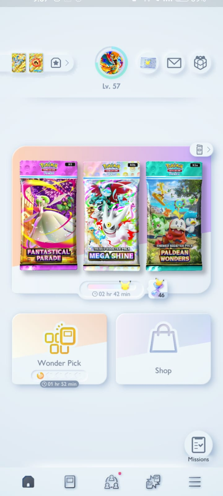
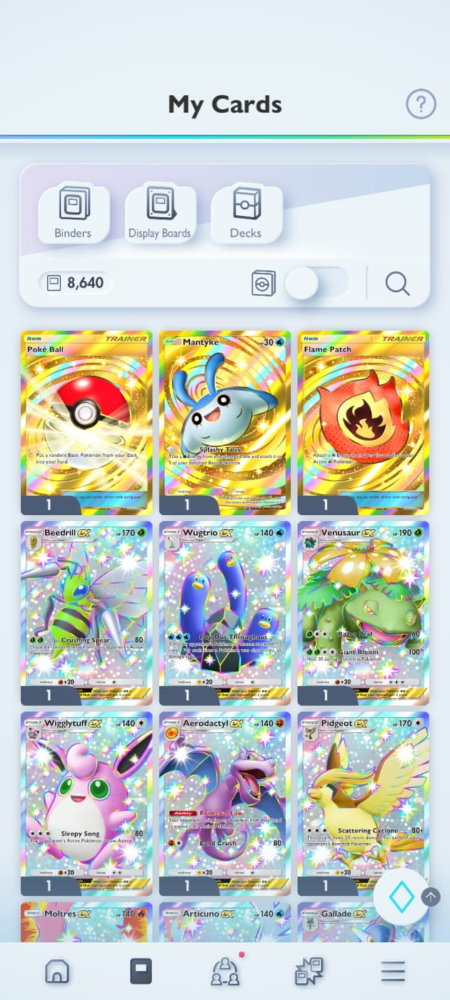
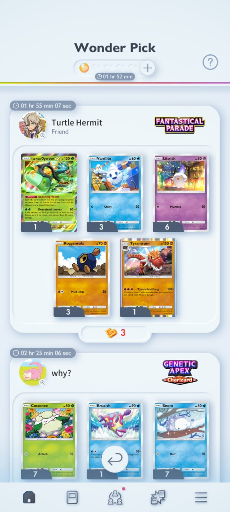

<div align="center">
  
  <h1>🌟 Pokémon TCG Pocket Luck Calculator</h1>
  <p><strong>The ultimate, data-driven analytical companion for Pokémon TCG Pocket.</strong></p>

  <p>
    
    
    
    
  </p>
</div>

<br />

> *"Did you really get lucky pulling that Crown Rare Charizard ex? Or was it just statistical inevitability?"*

Welcome to the **Pokémon TCG Pocket Luck Calculator**. This is a premium, client-side React application designed to calculate the true mathematical probability and luck of your booster pack pulls. By mapping directly to official datamined drop rates, the "Rotom Dex Engine" analyzes your pulls to assign a precise **Z-Score**, letting you know definitively if Arceus is smiling upon you, or if you've been cursed by the gacha gods.

---

## 📸 App Showcase

<div align="center">
  <table>
    <tr>
      <td align="center"><strong>The Archives</strong></td>
      <td align="center"><strong>Pack Opening Analytics</strong></td>
      <td align="center"><strong>Professor's Evaluation</strong></td>
    </tr>
    <tr>
      <td></td>
      <td></td>
      <td></td>
    </tr>
  </table>
</div>

---

## 🧠 How The Math Works (The Rotom Dex Engine)

Gacha games rely on complex probability matrices, and Pokémon TCG Pocket is no exception. Our engine doesn't just look at what you pulled; it calculates what you *should* have pulled.

1. **Expansion Mapping**: The calculator dynamically adjusts depending on the set. Did you open *Genetic Apex* or *Mega Rising*? The app knows the exact sub-rates, including the elusive `Shiny Slot 6` triggers for specific sets.
2. **Expected Value (EV)**: We calculate the exact mathematical EV of pulling every single rarity across your total packs opened.
3. **Z-Score Normalization**: We compare your actual hits against the EV using standard deviation. We then normalize this into a clean **1 to 10 scale**. 
   - A score of `5.0` means you are perfectly average.
   - A score of `9.0+` means your luck is legendary.
   - A score below `3.0` means it's time to take a break.

---

## 🃏 Tracked Rarities & Base Global Odds

The application tracks every official rarity level in the game. Here is a snapshot of the base global pool configuration before set-specific modifiers are applied:

| Rarity Level | In-Game Icon | Estimated Pull Weight | Notes |
| :--- | :---: | :--- | :--- |
| **Crown Rare** | 👑 | `~0.012%` | The absolute pinnacle of collecting. |
| **3-Star Immersive** | ☆☆☆ | `~0.222%` | Highly sought-after 3D interactive art. |
| **2-Star Special Art** | ☆☆ | `~0.500%` | Full art trainers and Pokémon. |
| **1-Star Illustration Rare** | ☆ | `~1.111%` | Beautiful, alternate-art basic cards. |
| **4-Diamond ex** | ♢♢♢♢ | `~1.666%` | Core meta staples. |
| **2-Shiny Double Shiny** | ✨✨ | `~0.100%` | Only available in Shiny-enabled expansions. |
| **1-Shiny Shiny Rare** | ✨ | `~0.300%` | Only available in Shiny-enabled expansions. |
| **God Pack** | 🌈 | `~0.050%` | Contains entirely rare pulls. Handled natively! |

---

## ✨ Core Features

- ⚡ **100% Client-Side Speed**: All complex probability calculations run directly in your browser. Zero loading screens, zero backend delays.
- 📱 **Apple-Grade Aesthetic**: Built from the ground up with high-end iOS glassmorphism styling, native fluid animations (powered by GSAP), and pixel-perfect UI elements.
- 🎨 **Authentic Assets**: Features the exact in-game PNG rarity symbols and high-res booster pack box art for absolute immersion.
- 📚 **Dynamic Archives**: Browse a digital Pokédex-style archive of over 10+ tracked booster packs from *Genetic Apex* to *Pulsing Aura*. Calculate your luck for specific sets instantly.
- 🌙 **Dark Mode Ready**: A gorgeous ambient background with shifting blobs that looks incredible in any lighting.

---

## 📂 Project Structure

A clean, modularized React structure built for scaling:

```text
├── public/                # Static assets (Not bundled by Vite)
│   ├── images/            # Showcase images, background assets, mockups
│   ├── icons/             # ♢ ☆ ✨ 👑 High-res rarity symbols
│   └── packs/             # High-res booster pack box art
├── src/                   # Application source code
│   ├── App.jsx            # Main view router & UI orchestration
│   ├── index.css          # Global styling, design tokens, animations
│   ├── math.js            # Probability engine & Z-Score algorithm
│   └── data.js            # Expansion database & pack configurations
├── index.html             # Application entry point
└── package.json           # Project dependencies
```

---

## 🚀 Getting Started

Want to run the Rotom Dex Engine on your local machine? It's incredibly simple:

1. **Clone the repository**
   ```bash
   git clone https://github.com/JashDoshi777/PokemonTCGP-luck-calculator.git
   ```
2. **Navigate to the directory**
   ```bash
   cd PokemonTCGP-luck-calculator
   ```
3. **Install dependencies**
   ```bash
   npm install
   ```
4. **Start the development server**
   ```bash
   npm run dev
   ```
   *Your app will be live at `http://localhost:5173/`*

---

## 🔮 What's Next? (Roadmap)

We are constantly updating the engine. Up next:
- [ ] **Infinite Pack Simulator**: A zero-friction visual gacha simulator using real drop rates.
- [ ] **Competitive "Brick" Calculator**: A Monte Carlo hand simulator for competitive players.
- [ ] **Trade Fairness Evaluator**: A pure math calculator for evaluating GTS trade fairness.

---

<div align="center">
  <i>May your daily pulls be blessed. 🍀</i>
</div>
